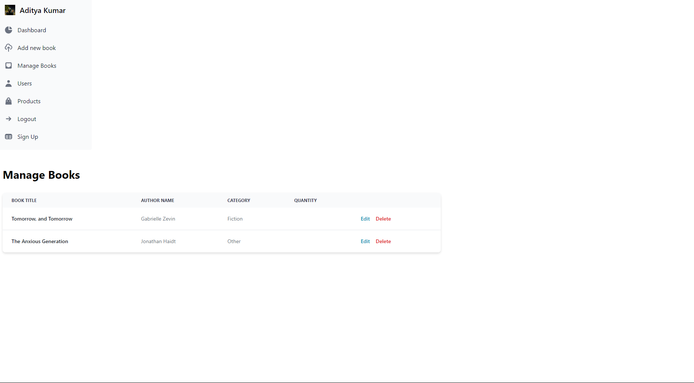
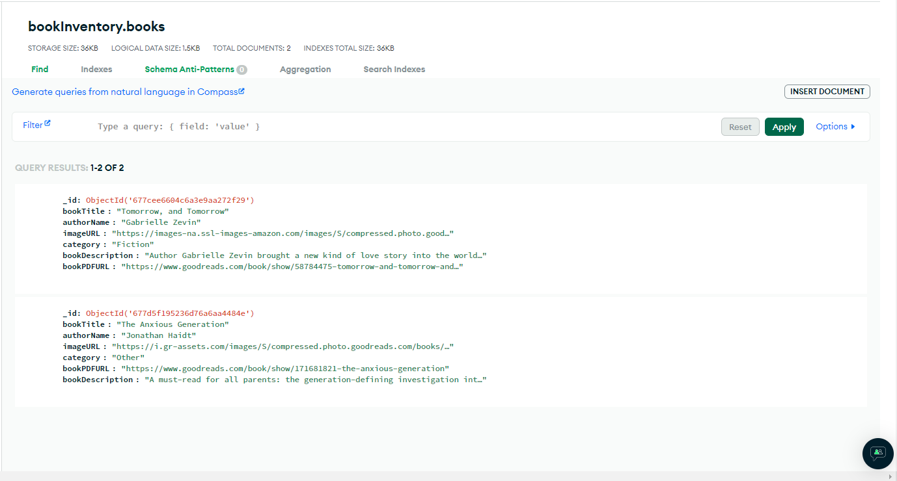

# Book-Management-Application
This is a full-stack CRUD Book Management application developed using React, Express, and Firebase for login authentication. The application allows admins to manage books and users to view available books.

# Features

Admin Features
Login using Firebase authentication.
Add new books with details like title, author, category, description, and book PDF URL.
Edit and delete existing books.
View all books in the admin dashboard.

# User Features

Login using Firebase authentication.
View all available books with their details.

# Tech Stack

Frontend: React.js, Tailwind CSS
Backend: Express.js, Node.js
Database: MongoDB
Authentication: Firebase Authentication

# Screenshots
### Sign in

### Home Page 1

### Home Page 2

### Dashboard

### Add book

### Edit book

### Database

### Firebase user authenticaton


# Install dependencies for both frontend and backend

## Install frontend dependencies
```bash
cd frontend
npm install
```

## Install backend dependencies
```bash
cd ../backend
npm install
```

# Start the development servers

## Start backend server
```bash
cd backend
npm start
```

## Start frontend in a new terminal
```bash
cd frontend
npm start
```
